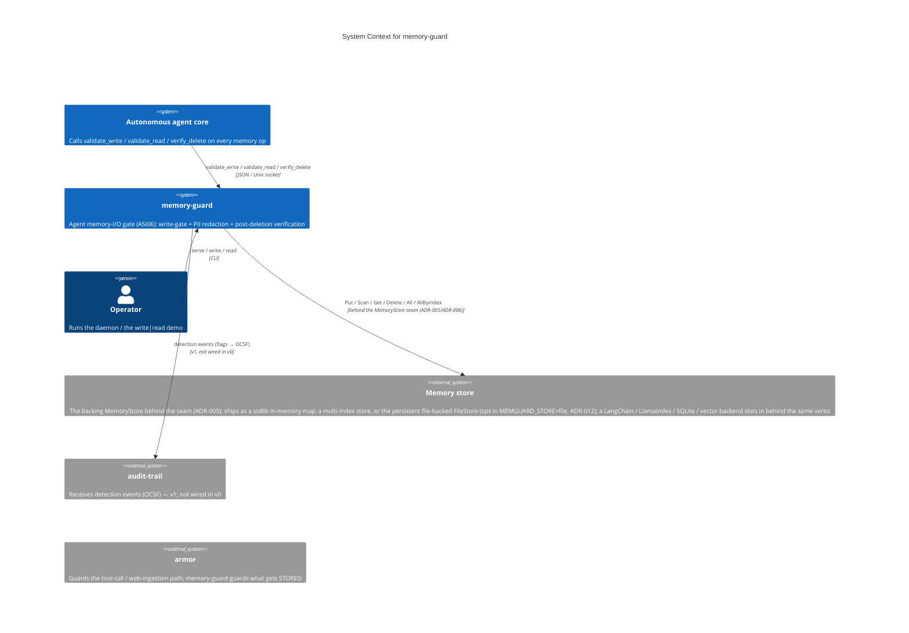
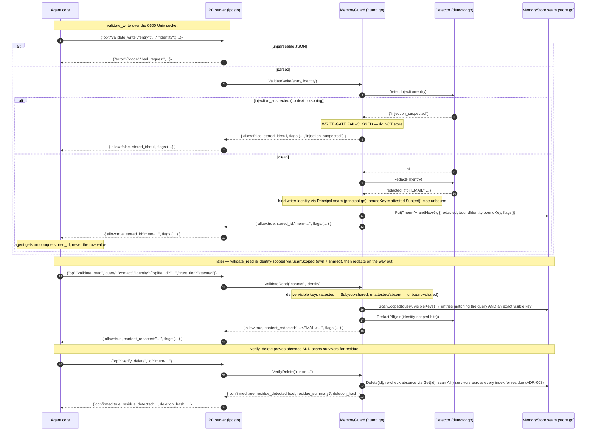

# Architecture Diagrams — memory-guard

**Last updated:** 2026-07-12 (task 016: store-side `ScanScoped` read verb + shared scope, ADR-013; task 015: persistent file-backed `FileStore` behind the unchanged seam, ADR-012)

C4-structured Mermaid diagrams plus the primary runtime sequence. See [overview.md](overview.md) for
prose context, [decisions/](decisions/) for the ADRs referenced here, and
[`../spec/architecture.md`](../spec/architecture.md) for the structured element catalog these
diagrams render.

These diagrams are part of the **authoritative spec**. Code changes that contradict a diagram either
invalidate the change or the diagram; one must be updated to match the other in the same commit.

> memory-guard is a single deployable binary that gates the agent's memory I/O. It has **two**
> load-bearing internal boundaries: the `Detector` seam (detection backend) and the `MemoryStore` seam
> (the storage backend — ADR-005, a single in-memory map, a multi-index store, or the persistent
> file-backed `FileStore` (ADR-012), swapped one-line behind the verbs). Its external integrations are the agent core (the three
> `validate_*`/`verify_delete` verbs) and `audit-trail` (detection events, v1 — not wired in v0).
> Container and Component collapse into one diagram.

---

## 1. System Context — who uses it and what it touches



Note: memory-guard guards what gets **stored**; `armor` guards what **enters** the agent (tool calls,
web ingestion). The two are complementary ASI06/ASI01 layers. The `audit-trail` emission is a v1
integration — v0 returns detections as `flags` but does not emit them.

---

## 2. Containers & Components — inside the binary

```mermaid
C4Component
    title Component view of memory-guard (single binary)

    System(agent, "Autonomous agent core")
    Person(operator, "Operator")

    Container_Boundary(boundary, "memory-guard binary") {
        Component(main, "CLI", "main.go", "serve / write / read subcommands; parse --socket; print WriteResult/ReadResult JSON for the one-shot demos; exit 2 on a missing/unknown subcommand")
        Component(ipc, "IPC server", "ipc.go", "serve: remove stale socket, bind 0600 Unix socket, frame newline-delimited JSON, dispatch validate_write/validate_read/verify_delete/ping over a shared *MemoryGuard; structured error shape {error:{code,message,retryable}}")
        Component(guard, "MemoryGuard core", "guard.go", "ValidateWrite (write-gate: DetectInjection → fail-closed on injection_suspected → RedactPII → store.Put), ValidateRead (store.ScanScoped over the reader's visible keys {Subject()|unbound, sharedScopeKey} → RedactPII; ADR-013), VerifyDelete (store.Delete → re-check absence via store.Get → scan store.AllByIndex() survivors across EVERY backing index/copy for residue, ADR-003/ADR-006: tiered normalized substring/phrase/token-overlap + number-word canonicalization, stdlib-only, returns confirmed/residue_detected/residue_summary? naming the index/deletion_hash)); talks to the store ONLY through the MemoryStore seam behind a sync.Mutex; mints opaque stored_id from crypto/rand")
        Component(store, "MemoryStore seam", "store.go / store_file.go / store_config.go", "MemoryStore interface (Put / Get / Delete / Scan / ScanScoped / All / AllByIndex; ScanScoped is the identity-scoped read verb, ADR-013) + 3 stdlib backings via NewStoreFromConfig (MEMGUARD_STORE): InMemoryStore (the default single map[string]entry; AllByIndex exposes one \"primary\" index), TwoIndexStore (primary id→entry map PLUS a secondary content→ids index; Delete purges both; AllByIndex names each), and the persistent FileStore (0600 JSONL snapshot rewritten atomically per mutation, read-through-disk, byte-level delete proof; ADR-012). The boundary that isolates the storage backend; ADR-005/ADR-006/ADR-012")
        Component(detector, "Detector seam", "detector.go / detector_config.go / detector_presidio.go", "Detector interface (RedactPII / DetectInjection) + 3 backends via NewDetectorFromConfig (MEMGUARD_DETECTOR): RegexDetector, Go-native NativeDetector (default, ADR-002), opt-in PresidioDetector (ADR-009: composite native-structured + Presidio NER, injection delegated to native UNCHANGED). The boundary that isolates the detection backend — no backend type leaks past it")
    }

    System_Ext(presidio, "Presidio sidecar", "presidio/sidecar.py — out-of-process Python: spaCy NER + Presidio recognizers (warm process); analyze JSON over stdin/stdout; NO runtime network; pinned base-only deps. Opt-in (MEMGUARD_DETECTOR=presidio)")

    Rel(agent, ipc, "validate_write / validate_read / verify_delete", "JSON / Unix socket")
    Rel(operator, main, "serve / write / read", "CLI")
    Rel(main, ipc, "serve --socket → serve(socketPath, guard)")
    Rel(main, guard, "write/read demos call ValidateWrite/ValidateRead in-process")
    Rel(ipc, guard, "dispatch op → ValidateWrite / ValidateRead / VerifyDelete")
    Rel(guard, detector, "DetectInjection (before store) + RedactPII (before store & on read)")
    Rel(detector, presidio, "analyze (only when MEMGUARD_DETECTOR=presidio)", "JSON / subprocess stdio")
    Rel(guard, store, "Put / Get / Delete / Scan / ScanScoped / All / AllByIndex (only string/entry/[]entry cross the seam)")
```

> **Two swap points — the `Detector` seam (ADR-001 §3) and the `MemoryStore` seam (ADR-005).** The v0
> `RegexDetector` can be replaced by a Presidio-backed detector (sidecar / ONNX) or a Go-native NER
> model **behind the `Detector` interface**; the default `InMemoryStore` can be replaced by a
> multi-index, persistent, or third-party store **behind the `MemoryStore` interface**. In both cases
> `MemoryGuard`, `ipc.go`, and the contract do not change — only `string` / `entry` / `[]entry` cross
> the storage seam, only `string` / `[]string` cross the detection seam. The detector deployment shape
> is **resolved** (ADR-009): the opt-in Presidio backend is an **out-of-process Python sidecar**, so the
> Go binary stays pure-Go / stdlib-only; the Go-native `NativeDetector` remains the `< 1 ms` hot-path
> default, and the Presidio sidecar is the opt-in rich-NER backend (~ms/op, revised budget). ONNX-in-
> process stays deferred behind the same seam.

**Key contracts**
- `validate_write(entry, identity) -> { allow, stored_id, flags }` — the **write-gate**:
  `DetectInjection` runs **before** storage; an `injection_suspected` flag rejects the write
  (`allow:false`, `stored_id:null`, nothing persists). A clean write is PII-redacted then stored, and
  an opaque `stored_id` (from `crypto/rand`) is returned — never the raw value (`guard.go::ValidateWrite`,
  ADR-001 §1).
- `validate_read(query, identity) -> { allow, content_redacted, flags }` — a single store-side
  `ScanScoped` over the reader's **visible-key set** (an attested reader sees its exact `Subject()`'s
  entries **plus shared-scope** entries; an unattested/absent reader sees **unbound plus shared**
  entries — ADR-004/ADR-013), and returns the survivors **PII-redacted** (defense in depth); v0 always
  `allow:true` (`guard.go::ValidateRead`).
- `verify_delete(id) -> { confirmed, residue_detected, residue_summary?, deletion_hash }` — deletes,
  **re-checks the store** to prove absence, then **scans the surviving entries across every backing
  index/copy** (`store.AllByIndex()`) for residue of the deleted content, naming the index it survives
  in (`guard.go::VerifyDelete` + `residue.go`, ADR-001 §5 / ADR-003 / ADR-006). The residue scan is a
  tiered normalized substring / phrase / token-overlap match with number-word canonicalization —
  stdlib-only guard-side logic, not a `Detector` concern.
- Every malformed / unknown request is **fail-closed** — a structured error, nothing stored
  (`ipc.go::errShape`, ADR-001 §7).

---

## 3. Primary runtime flow — validate_write (the write-gate path)



The `write` and `read` CLI subcommands exercise the in-process path (no socket bound) for operator
verification: `write` runs the write-gate on its argument and prints the `WriteResult`; `read` seeds
the store then reads it back redacted.

> **The write-gate is fail-closed (ADR-001 §1).** `DetectInjection` runs **before** storage; a
> suspected-poisoning entry never persists. PII is redacted before storage **and** again on read
> (defense in depth). `verify_delete` proves absence (re-checks the in-memory store) **and** scans the
> surviving entries for residue of the deleted content (ADR-003: tiered normalized substring / phrase /
> token-overlap, stdlib-only guard-side logic — not a `Detector` concern). All PII/injection detection
> is behind the `Detector` seam, so swapping the v0 `RegexDetector`
> for Presidio leaves this sequence shape unchanged.

ADR governing this flow: [ADR-001](decisions/001-foundational-stack.md) (write-gate fail-closed,
`Detector` seam, the `validate_*` contract, post-deletion verification, fail-closed errors). A future
Presidio-backed detector swaps only the `Detector` implementation behind the seam — this sequence
shape, the IPC framing, and the contract responses are preserved.

---

## Maintaining these diagrams

- **Trigger to update:** a new actor/container/component appears; a boundary moves; an external
  integration is added or removed (e.g. audit-trail emission wired, a real MemoryStore backend); an
  ADR changes a diagrammed flow. Keep [`../spec/architecture.md`](../spec/architecture.md) in sync.
- **Edit existing over adding new.** Duplicates rot independently.
- **Note ADRs that don't change diagrams.** An ADR that swaps the detector behind the `Detector` seam
  leaves the System Context and runtime-sequence shape unchanged.
- **Update the date at the top** when you change anything substantive.
</content>
