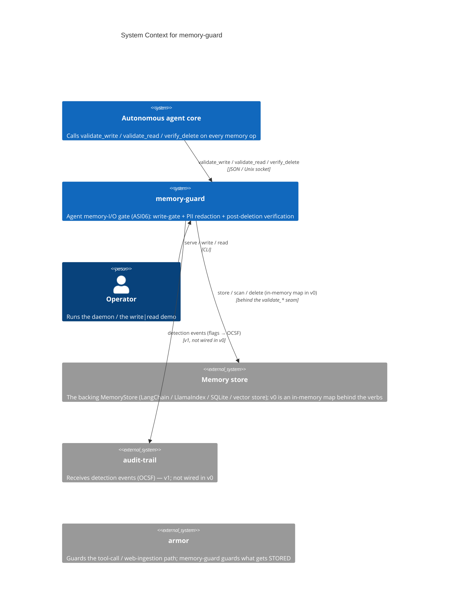
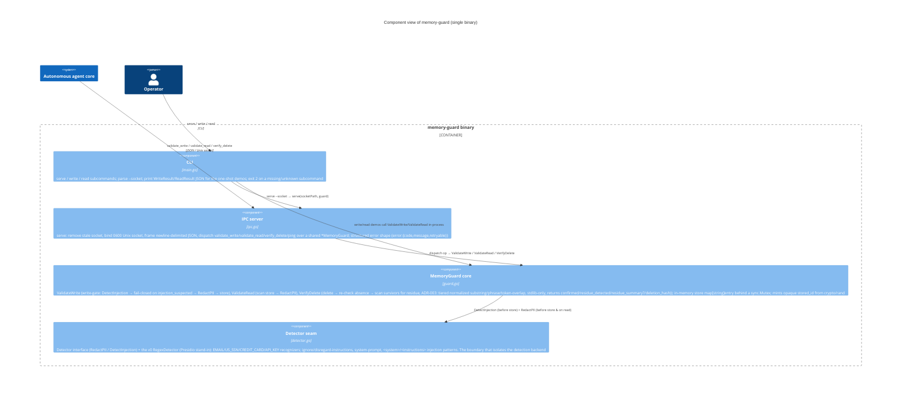

# Architecture Diagrams — memory-guard

**Last updated:** 2026-06-19 (task 003 — verify_delete residue scan, ADR-003)

C4-structured Mermaid diagrams plus the primary runtime sequence. See [overview.md](overview.md) for
prose context, [decisions/](decisions/) for the ADRs referenced here, and
[`../spec/architecture.md`](../spec/architecture.md) for the structured element catalog these
diagrams render.

These diagrams are part of the **authoritative spec**. Code changes that contradict a diagram either
invalidate the change or the diagram; one must be updated to match the other in the same commit.

> memory-guard is a single deployable binary that gates the agent's memory I/O. Its one load-bearing
> internal boundary is the `Detector` seam (detection backend); its external integrations are the
> agent core (the three `validate_*`/`verify_delete` verbs) and `audit-trail` (detection events, v1 —
> not wired in v0). Container and Component collapse into one diagram.

---

## 1. System Context — who uses it and what it touches



Note: memory-guard guards what gets **stored**; `armor` guards what **enters** the agent (tool calls,
web ingestion). The two are complementary ASI06/ASI01 layers. The `audit-trail` emission is a v1
integration — v0 returns detections as `flags` but does not emit them.

---

## 2. Containers & Components — inside the binary

> One deployable unit (the static Go binary). The load-bearing components a contributor touches first:



> **The `Detector` seam is the one swap point (ADR-001 §3).** The v0 `RegexDetector` can be replaced
> by a Presidio-backed detector (sidecar / ONNX) or a Go-native NER model **behind the `Detector`
> interface** — `MemoryGuard`, `ipc.go`, and the contract do not change. The detector deployment shape
> and the hot-path latency budget are deferred to the memory-guard tracer.

**Key contracts**
- `validate_write(entry, identity) -> { allow, stored_id, flags }` — the **write-gate**:
  `DetectInjection` runs **before** storage; an `injection_suspected` flag rejects the write
  (`allow:false`, `stored_id:null`, nothing persists). A clean write is PII-redacted then stored, and
  an opaque `stored_id` (from `crypto/rand`) is returned — never the raw value (`guard.go::ValidateWrite`,
  ADR-001 §1).
- `validate_read(query, identity) -> { allow, content_redacted, flags }` — scans the store for
  substring hits and returns them **PII-redacted** (defense in depth); v0 always `allow:true`
  (`guard.go::ValidateRead`).
- `verify_delete(id) -> { confirmed, residue_detected, residue_summary?, deletion_hash }` — deletes,
  **re-checks the store** to prove absence, then **scans the surviving entries for residue** of the
  deleted content (`guard.go::VerifyDelete` + `residue.go`, ADR-001 §5 / ADR-003). The residue scan is
  a tiered normalized substring / phrase / token-overlap match — stdlib-only guard-side logic, not a
  `Detector` concern.
- Every malformed / unknown request is **fail-closed** — a structured error, nothing stored
  (`ipc.go::errShape`, ADR-001 §7).

---

## 3. Primary runtime flow — validate_write (the write-gate path)

```mermaid
sequenceDiagram
    autonumber
    participant Agent as Agent core
    participant IPC as IPC server (ipc.go)
    participant Guard as MemoryGuard (guard.go)
    participant Det as Detector (detector.go)
    participant Store as In-memory store

    Note over Agent,IPC: validate_write over the 0600 Unix socket
    Agent->>IPC: {"op":"validate_write","entry":"…","identity":{…}}
    alt unparseable JSON
        IPC-->>Agent: {"error":{"code":"bad_request",...}}
    else parsed
        IPC->>Guard: ValidateWrite(entry, identity)
        Guard->>Det: DetectInjection(entry)
        alt injection_suspected (context poisoning)
            Det-->>Guard: ["injection_suspected"]
            Note over Guard: WRITE-GATE FAIL-CLOSED — do NOT store
            Guard-->>IPC: { allow:false, stored_id:null, flags:[…,"injection_suspected"] }
            IPC-->>Agent: { allow:false, stored_id:null, flags:[…] }
        else clean
            Det-->>Guard: nil
            Guard->>Det: RedactPII(entry)
            Det-->>Guard: redacted, ["pii:EMAIL",…]
            Guard->>Store: store[ "mem-"+randHex(6) ] = { redacted, identity, flags }
            Guard-->>IPC: { allow:true, stored_id:"mem-…", flags:[…] }
            IPC-->>Agent: { allow:true, stored_id:"mem-…", flags:[…] }
            Note over Agent: agent gets an opaque stored_id, never the raw value
        end
    end

    Note over Agent,Store: later — validate_read redacts again on the way out
    Agent->>IPC: {"op":"validate_read","query":"contact"}
    IPC->>Guard: ValidateRead("contact", identity)
    Guard->>Store: scan for entries containing the query
    Guard->>Det: RedactPII(join(hits))
    Guard-->>IPC: { allow:true, content_redacted:"…<EMAIL>…", flags:[…] }
    IPC-->>Agent: { allow:true, content_redacted:"…", flags:[…] }

    Note over Agent,Store: verify_delete proves absence AND scans survivors for residue
    Agent->>IPC: {"op":"verify_delete","id":"mem-…"}
    IPC->>Guard: VerifyDelete("mem-…")
    Guard->>Store: delete(id); re-check presence; scan survivors for residue (ADR-003)
    Guard-->>IPC: { confirmed:true, residue_detected:bool, residue_summary?, deletion_hash }
    IPC-->>Agent: { confirmed:true, residue_detected:…, deletion_hash:… }
```

The `write` and `read` CLI subcommands exercise the in-process path (no socket bound) for operator
verification: `write` runs the write-gate on its argument and prints the `WriteResult`; `read` seeds
the store then reads it back redacted.

> **The write-gate is fail-closed (ADR-001 §1).** `DetectInjection` runs **before** storage; a
> suspected-poisoning entry never persists. PII is redacted before storage **and** again on read
> (defense in depth). `verify_delete` proves absence (re-checks the in-memory store) **and** scans the
> surviving entries for residue of the deleted content (ADR-003: tiered normalized substring / phrase /
> token-overlap, stdlib-only guard-side logic — not a `Detector` concern). All PII/injection detection
> is behind the `Detector` seam, so swapping the v0 `RegexDetector`
> for Presidio leaves this sequence shape unchanged.

ADR governing this flow: [ADR-001](decisions/001-foundational-stack.md) (write-gate fail-closed,
`Detector` seam, the `validate_*` contract, post-deletion verification, fail-closed errors). A future
Presidio-backed detector swaps only the `Detector` implementation behind the seam — this sequence
shape, the IPC framing, and the contract responses are preserved.

---

## Maintaining these diagrams

- **Trigger to update:** a new actor/container/component appears; a boundary moves; an external
  integration is added or removed (e.g. audit-trail emission wired, a real MemoryStore backend); an
  ADR changes a diagrammed flow. Keep [`../spec/architecture.md`](../spec/architecture.md) in sync.
- **Edit existing over adding new.** Duplicates rot independently.
- **Note ADRs that don't change diagrams.** An ADR that swaps the detector behind the `Detector` seam
  leaves the System Context and runtime-sequence shape unchanged.
- **Update the date at the top** when you change anything substantive.
</content>
